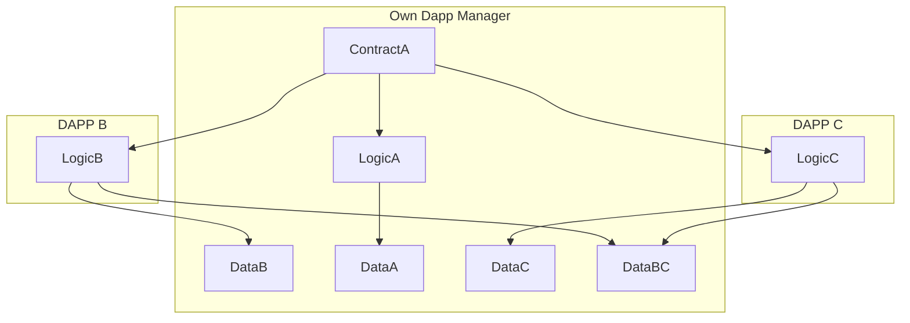
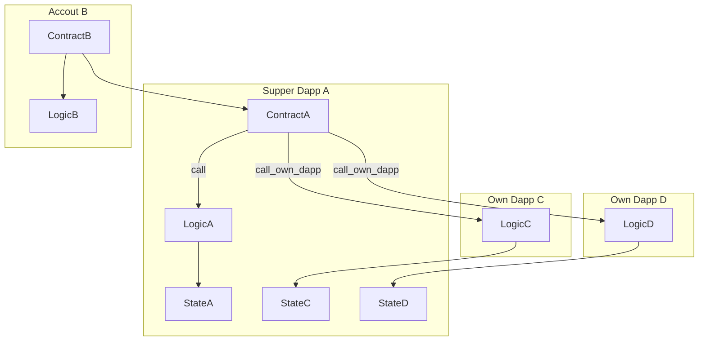

# superdapp

The Supper Dapp manageing modular Own Dapps. The Supper Dapp manages all Own Dapps without a limit on the number. Here, Own Dapp refers to a code logic that is declared. Own Dapps can share storage among themselves.

1. Provide a single smart contract address to support multiple Own Dapps.
2. This proposal can be based on the Standard Account Interface [SNIP-5](./snip-5.md), allowing each user to truly own their Own Dapp (e.g., Own NFT market, dex, inheritance, asset management, etc.).
3. Shared storage for Own Dapps and reusable logic, offering stronger composability.
4. Provide the ability to enable or disable one or more Own Dapps.
5. Own Dapps can be developed progressively, allowing your Supper Dapp to grow continuously.
6. Supper Dapp modularly manages Own Dapps, and adding new Own Dapps does not require upgrading the smart contract.
7. Direct support for some of the currently declared Dapp smart contracts.

### Storage among different Own Dapps

### External accounts call Supper Dapp’s Own Dapp logic

## Copyright

Copyright and related rights waived via [MIT](../LICENSE).
